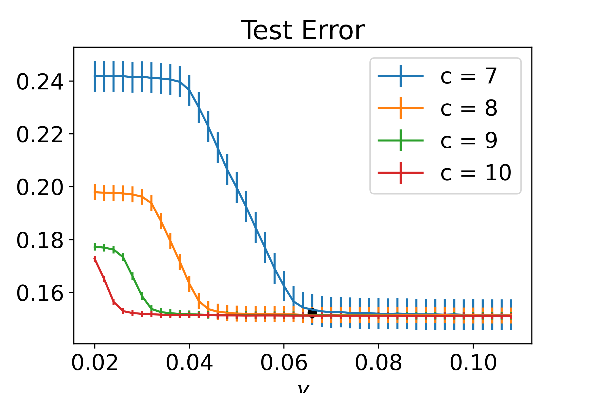

# PracticeML:A Fair Empirical Risk Minimization with Generalized Entropy

This program, "FairHedge.py",  performs the following tasks
1. Finding a (sub)optimal  randomized classifier that minimizes 
the empirical risk and satisfies the fairness constraint given by the generalized entropy: 
this is implemented in the function GEFairHedge( ).
2. Applying the (sub)optimal randomized classifier to the test data set.
3. Generating figures showing the results.

The function, GEFairHedge( ), is the implementaion of the algorithm in the papper. 

## Requirements 

Nothing is required. 
Just run FairHedge.py.

## Training

GEFairHedge(), from Line 95 to Line 152 and 

the code block  from  Line 207 to Line 270 for training LogisticRegression for a base classifier of GEFairHedge( )

## Evaluation

From Line 340 to Line 345. 

Use Line 221 - Line 230 to change the values of a, c, gamma.
Use Line 232 and Line 233 to change the values of nu and lambda_max

## Results

1. Plots for test error, test generalized entropy for  alpha = {0, 1, 2}, a=5, c= {7, 8, 9, 10}, and various gammas: after 10000 times running because 
the optimal risk minimizer we obtain is a randomized one.
}"error0.png"
2. Plots for time averaged empirical error and emprical generalized entropy for alpha = {0,1,2}, a=5, c={7,8,9,10} and gamma =0.05: use Line 330 if you want a different gamma value from 0.05. 

## Datasets
#### adult: adult-all.csv 
