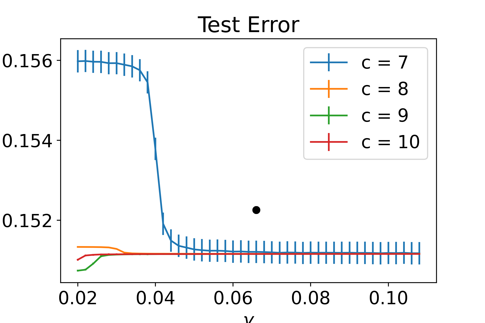

# Paper Title: A Fair Empirical Risk Minimization with Generalized Entropy

This program, "FairHedge.py",  performs the following tasks: 
1. Finding a (sub)optimal  randomized classifier that minimizes 
the empirical risk and satisfies the fairness constraint given by the generalized entropy: 
this is implemented in the function GEFairHedge( ).
2. Applying the (sub)optimal randomized classifier to the test data set.
3. Generating figures showing the results.

The function, GEFairHedge( ) (from Line 89 to Line 146), is the implementaion of the algorithm in the papper. 

## Requirements 

Nothing is required.

Just run FairHedge.py.

Datasets used: "adult-all.csv" (You can down load from https://archive.ics.uci.edu/ml/datasets/adult)

## Training

GEFairHedge(), from Line 89 to Line 146 and 

the code block  from  Line 198 to Line 204 for training LogisticRegression 
for a base classifier of GEFairHedge( )

## Evaluation

From Line 333 to Line 339 and 
ApplyToTestSet( ) (from Line 149 to Line 159). 

Use Line 215 - Line 224 to change the values of a, c, gamma.
Use Line 226 and Line 227 to change the values of nu and lambda_max

# Pre-trained models
No pre-trained model.

## Results

1. Plots for test error, test generalized entropy for  alpha = {0, 1, 2}, a=5, c= {7, 8, 9, 10}, 
and various gammas: after 10000 times running because 
the optimal risk minimizer we obtain is a randomized one. 
X-axis is gamma for all plots. 
Use Line 231 (the variable, max_repeat,) if you want to  change the number of runnings.  

"Test Error: alpha=0, a=5"
"Test Error: alpha=1, a=5"
"Test Error: alpha=2, a=5"
"Test GE: alpha=0, a=5"
"Test GE: alpha=1, a=5"
"Test GE: alpha=2, a=5"

2. Plots for time averaged empirical error and emprical generalized entropy 
for alpha = {0,1,2}, a=5, c={7,8,9,10} and gamma =0.05: 
use Line 323 if you want a different gamma value from 0.05 for a new plot. 
X axis is time t for all t.

"Time Aveaged Emprirical Error: alpha=0, a=5"
"Time Aveaged Emprirical Error: alpha=1, a=5"
"Time Aveaged Emprirical Error: alpha=2, a=5"
"Time Aveaged Emprirical GE: alpha=0, a=5"
"Time Aveaged Emprirical GE: alpha=1, a=5"
"Time Aveaged Emprirical GE: alpha=2, a=5"

 
